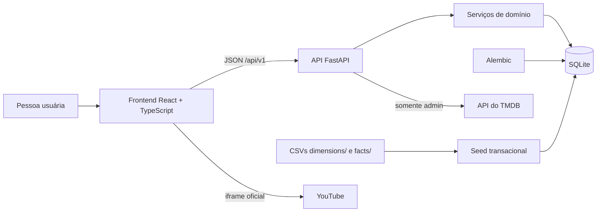

# CineData Analytics

Plataforma full-stack de descoberta, avaliação e conversa sobre filmes,
desenvolvida para a atividade DEV do Visagio Rocket Lab 2026.2. O CineData
combina um catálogo cinematográfico com recursos sociais e ferramentas de
análise para quem administra a plataforma.

O projeto é uma aplicação de demonstração executada localmente. Os dados são
armazenados em SQLite e os serviços podem ser iniciados juntos com Docker
Compose. Os recursos principais funcionam sem serviços externos.

## O que a aplicação oferece

| Área | O que permite fazer |
| --- | --- |
| Início e catálogo | Descobrir filmes em cards com pôsteres, pesquisar, filtrar, ordenar e navegar por páginas. |
| Detalhes de filme | Consultar sinopse, elenco/equipe, produtoras, métricas, avaliações e trailers disponíveis. |
| Avaliações | Criar, editar ou apagar a própria nota e resenha; notas podem ser qualquer valor numérico entre 0 e 10. |
| Listas | Criar curadorias pessoais, escolher a lista diretamente no detalhe de um filme e acompanhar os filmes já avaliados. |
| Perfis e amizades | Editar o próprio nome e avatar, consultar perfis públicos e enviar ou responder a pedidos de amizade. |
| Comunidades | Participar de conversas sobre cinema, mencionar filmes, comentar publicações e reagir; admins podem moderar publicações e comentários individuais. |
| Mapa de gostos | Explorar recomendações conectadas aos filmes avaliados, com sinais de afinidade explicáveis. |
| Analytics | Acompanhar indicadores agregados e tendências calculados a partir da atividade registrada no banco. |
| Ferramentas administrativas | Manter o catálogo e as comunidades, importar dados de filmes do TMDB e consultar analytics. |

O tema visual é escuro, com identidade em vermelho e destaque editorial na home.
Spider-Man: Across the Spider-Verse aparece como seleção editorial acompanhada
por seu trailer oficial; o filme também está presente no catálogo local.

## Experiência no frontend

O frontend é uma SPA feita em React e TypeScript. Os fluxos detalhados,
comportamentos de mídia e estados da interface estão em
[docs/frontend.md](docs/frontend.md).

## Perfis de acesso

| Ação | Visitante | `user` | `admin` |
| --- | :---: | :---: | :---: |
| Consultar catálogo, detalhes, trailers e perfis públicos | ✓ | ✓ | ✓ |
| Criar conta e iniciar sessão | ✓ | ✓ | ✓ |
| Avaliar filmes, criar listas e participar socialmente | — | ✓ | ✓ |
| Editar o próprio perfil e ver seus dados privados | — | ✓ | ✓ |
| Criar, editar e remover filmes do catálogo | — | — | ✓ |
| Criar e administrar comunidades | — | — | ✓ |
| Consultar analytics e usar a importação administrativa do TMDB | — | — | ✓ |

O cadastro público sempre cria uma conta `user`. A promoção a `admin` é feita
por configuração e bootstrap; não existe opção de se tornar administrador pelo
formulário de cadastro.

### Histórias de usuário

- Como visitante, quero descobrir filmes e conhecer conversas públicas antes
  de criar uma conta.
- Como pessoa autenticada, quero registrar minhas opiniões e organizar filmes
  enquanto participo da comunidade.
- Como administrador, quero manter o catálogo e as comunidades e acompanhar a
  atividade da plataforma.

## Arquitetura



### Tecnologias

| Camada | Tecnologias e responsabilidades |
| --- | --- |
| Interface | React 19, TypeScript, Vite e CSS; componentes por área do produto. |
| Cliente HTTP | `fetch`, tipos TypeScript para contratos, cache de leitura, sessão Bearer e invalidação após alterações. |
| API | Python 3.11+, FastAPI, Pydantic e Uvicorn; routers versionados sob `/api/v1`. |
| Domínio e persistência | SQLAlchemy assíncrono, SQLite com `aiosqlite`, serviços por domínio e relações explícitas. |
| Schema e carga | Alembic para migrações; comando de seed separado e transacional para os CSVs. |
| Integração externa | Cliente TMDB no backend; trailers de vídeo reproduzidos pelo iframe oficial do YouTube. |
| Testes e qualidade | pytest e Ruff no backend; Vitest, Testing Library e oxlint no frontend. |
| Execução local | Docker Compose com serviços de backend e frontend e volume nomeado para o banco. |

### Organização do repositório

```text
backend/
  app/
    analytics/       Agregações e schemas do painel administrativo
    api/v1/          Rotas HTTP versionadas
    communities/     Modelos, regras e schemas das comunidades
    core/            Configuração, logging e erros públicos
    db/              Sessão, importador CSV e tarefas de dados
    integrations/    Cliente para a API TMDB
    movies/          Catálogo, avaliações e modelos relacionais
    taste_map/       Cálculo do mapa de gostos e recomendações
    users/           Contas, segurança, perfis, listas e amizades
  migrations/        Histórico Alembic do schema
  tests/             Testes de API, domínio, segurança e carga
frontend/
  src/
    api/             Cliente HTTP e tipos de integração
    auth/            Persistência da sessão no navegador
    components/      Catálogo, formulários, listas e áreas sociais
    pages/           Telas principais
    hooks/           Carregamento de recursos e mutações
    lib/             Conversões e utilitários de interface
data/raw/
  dimensions/        CSVs de dimensões do catálogo
  facts/             CSVs de métricas, avaliações e relações
docs/
  api-v1.md          Contratos e regras da API
  frontend.md        Comportamentos detalhados da interface e mídia
TODO.md              Escopo, etapas e critérios de conclusão
docker-compose.yml   Execução local dos dois serviços
```

## Backend e API

A API FastAPI separa rotas HTTP, regras de domínio e persistência. A lista
completa de endpoints, parâmetros, respostas e permissões está em
[docs/api-v1.md](docs/api-v1.md). A documentação interativa fica em
`http://localhost:8000/docs`; a sessão demo do Compose é omitida da OpenAPI.

### Regras de integridade e segurança

- Senhas nunca são armazenadas em texto puro; o backend usa hash Argon2.
- O login devolve um JWT Bearer. O frontend guarda a sessão no armazenamento
  local do navegador e envia o token nas requisições autenticadas.
- A API verifica autenticação, propriedade dos recursos e papel administrativo
  no servidor; esconder um botão no frontend não substitui a autorização.
- Uma restrição única parcial no banco impede mais de uma avaliação por conta
  e filme, inclusive quando duas escritas chegam simultaneamente. Avaliações
  importadas, sem conta associada, não são limitadas por essa regra.
- Migrações Alembic são a única autoridade para criar e evoluir o schema. O
  importador não cria tabelas e falha se o banco ainda não estiver migrado.
- CORS permite somente as origens configuradas. A configuração padrão local é
  `http://localhost:5173`; o Compose também permite `http://localhost:8080`.
- O token do TMDB permanece no backend e não é retornado ao navegador.

## Dados e modelo relacional

O catálogo local parte de dez CSVs versionados em `data/raw/`. Eles representam
dimensões, métricas, avaliações e relações muitos-para-muitos. A carga inicial
do Compose processa aproximadamente 1,7 milhão de registros; entre eles estão
95.645 filmes e as relações com gêneros, pessoas e produtoras. O conjunto é
usado localmente e a carga pode ser repetida sem duplicar as chaves fornecidas.

### Inventário das tabelas

As tabelas do catálogo preservam o esquema relacional de origem dos dados. As
chaves `sk_*` são as chaves substitutas importadas dos CSVs; `id_filme` é o
identificador de negócio único exposto pela API.

| Tabela | Grão / chave principal | Conteúdo e relações |
| --- | --- | --- |
| `dim_movies` | Um registro por filme (`sk_movie_id`) | `id_filme` único, título, data e ano de lançamento, duração, status, sinopse, URL do pôster, backdrop e trailer. É a entidade central; possui relações com equipe, gêneros, produtoras, métricas e avaliações. |
| `dim_genres` | Um registro por gênero (`sk_genre_id`) | Nome de gênero único. Relaciona-se a filmes por `bridge_movie_genre`. |
| `dim_people` | Uma pessoa em um papel (`sk_person_id`) | Nome e papel (`Ator`, `Diretor` ou `Roteirista`); combinação nome/papel é única. Relaciona-se a filmes por `bridge_movie_person`. |
| `dim_companies` | Uma produtora (`sk_company_id`) | Nome de produtora/estúdio único. Relaciona-se a filmes por `bridge_movie_company`. |
| `fact_movies_performance` | No máximo uma linha por filme (`sk_movie_id`) | Orçamento, receita e lucro em USD/BRL, popularidade, notas e quantidades de votos de TMDB/IMDb. Métricas desconhecidas permanecem nulas quando aplicável. |
| `dim_reviews` | Um resumo por filme (`sk_review_id`; `sk_movie_id` único) | Quantidade e média agregada das avaliações importadas. Não contém a resenha individual da conta. |
| `movie_reviews` | Uma avaliação individual (`sk_movie_review_id`) | Filme, autor exibido, nota, comentário e data. `user_id` é nulo para avaliações importadas e aponta para `users` nas avaliações da aplicação; contém também a visibilidade. |
| `bridge_movie_genre` | Um par filme/gênero | Chave composta por filme e gênero; impede relações repetidas e permite consultas por gênero. |
| `bridge_movie_person` | Um par filme/pessoa | Chave composta por filme e pessoa; contém índice para busca por pessoa. |
| `bridge_movie_company` | Um par filme/produtora | Chave composta por filme e produtora. |
| `users` | Uma conta (`id`) | E-mail único, nome, hash de senha, papel (`user`/`admin`), avatar e timestamps. |
| `user_lists` | Uma lista pessoal (`id`) | Dono, nome, visibilidade (`publica`/`privada`) e timestamps. Cada lista pertence a uma conta. |
| `user_list_movies` | Um par lista/filme | Associação com chave composta e data de inclusão; um filme não se repete na mesma lista. |
| `watch_later_movies` | Um par conta/filme | Associação da funcionalidade especial “assistir depois”. É opcional na experiência e separada das listas personalizadas. |
| `friendship_requests` | Um pedido direcionado (`id`) | Solicitante, destinatário, estado (`pendente`, `aceita`, `bloqueada`) e timestamps; não permite autorrelacionamento nem repetir o mesmo par direcionado. |
| `communities` | Uma comunidade (`id`) | Nome único, descrição, URL de imagem opcional, contador de visualizações e timestamps. |
| `community_memberships` | Um par comunidade/conta | Associação de participação com chave composta e data de entrada. |
| `community_posts` | Uma publicação (`id`) | Comunidade, autor, conteúdo, timestamps, filme opcional mencionado e indicador de remoção por moderação. Se o filme for apagado, a publicação permanece sem a referência. |
| `community_comments` | Um comentário (`id`) | Publicação, autor, conteúdo, data e indicador de remoção por moderação. Comentários pertencem a uma publicação. |
| `community_reactions` | Um par publicação/conta | Uma reação por pessoa e publicação; tipos permitidos: `curtir`, `amei` e `interessante`. |

#### Relações e regras de integridade

- As três tabelas `bridge_*` resolvem relações muitos-para-muitos entre filmes,
  gêneros, pessoas e produtoras. Chaves compostas impedem duplicar o mesmo
  vínculo.
- `fact_movies_performance` e `dim_reviews` são relações um-para-um com o filme.
  Os valores da origem não são misturados com colunas próprias da interface.
- `movie_reviews` reúne registros importados e avaliações criadas na aplicação.
  A distinção é `user_id IS NULL` versus uma FK para `users`; apagar a conta
  deixa a avaliação sem vínculo, não apaga o histórico (`ON DELETE SET NULL`).
- Existe no máximo uma avaliação com conta por filme, garantido no banco por
  índice único parcial em `(user_id, sk_movie_id)` apenas quando `user_id` não
  é nulo. Isso mantém avaliações importadas sem usuário fora da restrição e
  protege também escritas simultâneas.
- Notas têm `CHECK` de `0` a `10`; papéis, visibilidades, tipos de pessoa,
  estados de amizade e reações também têm restrições de domínio no schema.
- Exclusões de entidades proprietárias usam `ON DELETE CASCADE` para limpar
  associações dependentes, com exceções explícitas como a referência opcional
  de filme em uma publicação (`SET NULL`).
- `alembic_version` é a tabela técnica do Alembic e registra a revisão aplicada.
  Analytics não cria tabelas próprias: as métricas são agregadas a partir das
  avaliações, contas, listas, comunidades e publicações existentes.
- `movie_synopsis_fts` é uma tabela virtual FTS5 do SQLite, não um modelo de
  negócio do ORM. Triggers a mantêm sincronizada com inserções, alterações de
  sinopse e exclusões em `dim_movies`.
- Publicações e comentários moderados permanecem como registros de contexto,
  mas o conteúdo é apagado e a API os marca com `removida_por_moderacao`. A
  mensagem original não é retornada. Moderar uma publicação também redige seus
  comentários, remove a menção a filme e apaga as reações associadas.

### Histórico de evolução do schema

As revisões formam uma cadeia linear; a inicialização aplica todas as
migrações pendentes com `alembic upgrade head`. As revisões 0013–0015 acrescentam
integridade de avaliações, desempenho do mapa e moderação de conteúdo.

| Revisão | Alteração persistente |
| --- | --- |
| `0001_initial_movie_schema` | Cria dimensões e relações do catálogo, métricas financeiras/externas, resumos e avaliações individuais importadas. Inclui chaves, FKs, unicidades e validação da escala de notas. |
| `0002_add_catalog_filter_index` | Adiciona índice em `bridge_movie_genre.sk_genre_id` para acelerar filtro por gênero. |
| `0003_add_local_users` | Cria `users`, com e-mail único, papel restrito a `user` ou `admin`, hash de senha e datas de auditoria. |
| `0004_link_reviews_to_users` | Adiciona `movie_reviews.user_id` nullable. Preserva avaliações anteriores sem autor autenticado. |
| `0005_add_user_lists` | Cria `user_lists`, `user_list_movies` e `watch_later_movies`, com visibilidade e unicidades por associação. |
| `0006_add_trailer_to_movies` | Adiciona `dim_movies.url_trailer`, opcional. |
| `0007_add_user_avatars` | Adiciona `users.avatar_url`, opcional. |
| `0008_add_friendship_requests` | Cria `friendship_requests`, estados controlados, FKs e unicidade do par solicitante/destinatário. |
| `0009_add_review_visibility` | Adiciona visibilidade pública/privada às avaliações, com padrão público e `CHECK`. |
| `0010_add_communities` | Cria `communities`, `community_memberships`, `community_posts`, `community_comments` e `community_reactions`. |
| `0011_add_community_views` | Adiciona contador `communities.visualizacoes` para ordenação de descoberta. |
| `0012_add_community_image` | Adiciona `communities.imagem_url`, opcional. |
| `0013_unique_user_movie_review` | Verifica duplicatas existentes e cria índice parcial único conta/filme; falha sem apagar dados se encontrar conflitos. |
| `0014_add_taste_map_synopsis_index` | Cria `movie_synopsis_fts`, preenche-a com sinopses atuais e adiciona triggers de sincronização para otimizar a seleção de candidatos do mapa. |
| `0015_add_community_moderation` | Adiciona `removida_por_moderacao` a `community_posts` e `community_comments`, permitindo ocultar conteúdo sem remover o contexto da conversa. |

As migrations ficam em [`backend/migrations/versions/`](backend/migrations/versions/).
O modelo declarativo correspondente está em `backend/app/movies/models.py`,
`backend/app/users/models.py` e `backend/app/communities/models.py`. As
migrações são mantidas separadas dos modelos para que bancos existentes possam
evoluir sem recriar o schema ou perder os dados carregados.

O arquivo de modelo dimensional descreve o catálogo carregado pela aplicação;
este repositório não afirma executar o pipeline Bronze/Silver/Gold do projeto de
Engenharia de Dados. O seed importa os CSVs preparados diretamente para o
schema relacional SQLite do CineData.

## Banco, migrações e seed

As migrações sequenciais e suas alterações estão detalhadas em “Histórico de
evolução do schema”, acima. O comando `python -m app.db.seed`:

1. verifica se as migrações foram aplicadas e se os arquivos e cabeçalhos são os
   esperados;
2. valida tipos, valores de domínio e referências entre CSVs;
3. grava os dados em lotes de até 10 mil linhas dentro de uma única transação;
4. apresenta progresso nos arquivos grandes e, ao final, as quantidades
   processadas por arquivo; em caso de erro, desfaz a
   transação inteira.

No SQLite, a carga usa WAL, sincronização `NORMAL` e cache de 64 MiB para
reduzir o custo da importação inicial sem dividir a transação. Depois que o
catálogo é carregado, as próximas inicializações do Compose pulam o seed quando
já existem filmes no banco.

A carga atualiza ou mantém registros pelas chaves existentes, então pode ser
reexecutada. O banco do Compose fica no volume Docker `cinedata-db` e sobrevive
a `docker compose down`; somente `docker compose down -v` remove esse volume.

### Desempenho do mapa de gostos

O mapa não carrega as relações do catálogo inteiro no ORM. Primeiro seleciona
no banco candidatos que compartilham gêneros, pessoas ou termos de sinopse;
sinopses usam o índice SQLite FTS5. Só então carrega as relações completas dos
melhores candidatos e calcula as similaridades detalhadas. O limite atual da
pré-seleção é 2.500 candidatos; os parâmetros finais e limites visuais são
descritos em [docs/api-v1.md](docs/api-v1.md).

Na medição local registrada em 26/09/2026 com os 95.645 filmes, uma geração do
mapa levou aproximadamente 4 segundos e atingiu cerca de 48 MB de pico de
memória Python. O tempo é uma referência daquele ambiente, não uma garantia
para todo hardware ou conjunto de dados.

## Como executar

### Opção recomendada: Docker Compose

1. Instale e inicie o Docker Desktop, usando o modo de containers Linux.
2. A configuração Compose já prepara a conta de demonstração `admin@admin.com`,
   com senha `admin123` e nome de perfil `admin`. As portas ficam acessíveis
   somente no próprio computador (`localhost`). Esses valores são exclusivos
   para demonstração local; não os use em uma instalação exposta à rede ou à
   internet. Para trocar as credenciais da demo, altere `INITIAL_ADMIN_EMAIL`,
   `INITIAL_ADMIN_NAME` e `INITIAL_ADMIN_PASSWORD` no `docker-compose.yml`.
   Configure um `JWT_SECRET_KEY` próprio no `.env` da raiz antes de expor o
   serviço a qualquer rede.
3. Execute na raiz:

```powershell
docker compose up --build
```

Não é necessário criar ou editar arquivos para iniciar a demonstração. Se
quiser habilitar a integração opcional com o TMDB, copie
`backend/.env.example` para `backend/.env` e configure `TMDB_API_TOKEN` antes de
iniciar o Compose.

Na primeira execução, o backend constrói o schema, aplica as migrações e carrega
os CSVs antes de ficar saudável; com esse catálogo, a preparação inicial pode
levar alguns minutos. O Compose cria/sincroniza a conta de demonstração e o
frontend inicia automaticamente já autenticado como `admin`.

Em reinicializações, o bootstrap sincroniza o nome e a senha da conta admin
configurada no Compose; isso garante que as credenciais de demonstração
continuem funcionando com o volume de banco já existente.

| Serviço | Endereço |
| --- | --- |
| Aplicação web | `http://localhost:8080` |
| API | `http://localhost:8000` |
| Documentação OpenAPI | `http://localhost:8000/docs` |
| Health check | `http://localhost:8000/health` |

Para encerrar sem apagar os dados, use `Ctrl+C` ou `docker compose down`. Para
apagar também o banco local do Compose, use `docker compose down -v`; isso é
irreversível para aquele volume, então faça-o somente se realmente quiser
recomeçar a carga do zero.

No ambiente Compose, `POST /api/v1/auth/sessao-teste` devolve uma sessão da
conta `admin` preparada para a demonstração. O frontend usa essa rota somente
no build Docker de demo e inicia autenticado. A rota não existe no modo de
desenvolvimento local.

### Execução local sem Docker

É necessário Python 3.11 ou superior e Node.js compatível com Vite 8 (Node 22 é
usado pela imagem Docker).

#### Backend

No PowerShell, a partir da raiz:

```powershell
Copy-Item backend\.env.example backend\.env
Set-Location backend
py -3.11 -m venv .venv
.\.venv\Scripts\python -m pip install -e ".[dev]"
```

Edite `backend/.env` para definir pelo menos uma `JWT_SECRET_KEY` segura. Para
criar o primeiro administrador, informe também `INITIAL_ADMIN_EMAIL`,
`INITIAL_ADMIN_NAME` e `INITIAL_ADMIN_PASSWORD`. `TMDB_API_TOKEN` é opcional.
Depois, ainda em `backend/`:

```powershell
.\.venv\Scripts\alembic upgrade head
.\.venv\Scripts\python -m app.db.seed --database-url "sqlite+aiosqlite:///./rocketlab.db"
.\.venv\Scripts\uvicorn app.main:app --reload
```

A API ficará em `http://localhost:8000`. Para preparar o administrador após as
migrações, se as variáveis estiverem configuradas, execute em outro terminal:

```powershell
Set-Location backend
.\.venv\Scripts\python -m app.users.bootstrap_admin
```

O bootstrap é seguro para repetir com o mesmo e-mail: não cria uma segunda
conta. Não há credenciais padrão embutidas no código.

#### Frontend

Em outro terminal PowerShell, a partir da raiz:

```powershell
Copy-Item frontend\.env.example frontend\.env
Set-Location frontend
npm install
npm run dev
```

O frontend ficará em `http://localhost:5173`. A variável
`VITE_API_BASE_URL` pode apontar para outro endereço da API; por padrão usa
`http://localhost:8000/api/v1`.

## Configuração e credenciais

| Variável | Onde é usada | Finalidade |
| --- | --- | --- |
| `DATABASE_URL` | Backend | URL do banco; localmente usa SQLite em `backend/rocketlab.db`. |
| `BACKEND_CORS_ORIGINS` | Backend | Lista de origens permitidas pelo CORS. |
| `JWT_SECRET_KEY` | Backend e configuração raiz do Compose | Assinatura dos tokens de sessão; use um segredo aleatório e exclusivo. |
| `JWT_ACCESS_TOKEN_EXPIRE_MINUTES` | Backend | Duração da sessão JWT. |
| `INITIAL_ADMIN_EMAIL` | Backend e configuração raiz do Compose | E-mail da primeira conta administrativa. |
| `INITIAL_ADMIN_NAME` | Backend e configuração raiz do Compose | Nome da conta administrativa inicial. |
| `INITIAL_ADMIN_PASSWORD` | Backend e configuração raiz do Compose | Senha inicial; mantenha-a fora do repositório. |
| `TMDB_API_TOKEN` | `backend/.env` | Token de leitura usado somente nas chamadas do backend ao TMDB. |
| `VITE_API_BASE_URL` | `frontend/.env` | Endereço-base da API usado pelo Vite no desenvolvimento. |

Os arquivos `.env` contêm segredos e não devem ser commitados. Os arquivos
`.env.example` são modelos sem credenciais reais.

## Testes e verificações

### Backend

```powershell
Set-Location backend
.\.venv\Scripts\python -m pytest
.\.venv\Scripts\ruff check .
```

Os testes do backend cobrem inicialização e configuração, cadastro e login,
permissões administrativas, catálogo e filtros, validação de avaliações,
listas, amizades, perfis, comunidades, analytics, mapa de gostos, integração
com TMDB, segurança de usuários e importação dos CSVs.

### Frontend

```powershell
Set-Location frontend
npm run lint
npm run test
npm run build
```

Vitest e Testing Library cobrem a interação dos componentes com estados de
sucesso, carregamento, erro e formulários, incluindo catálogo, avaliação,
autenticação, listas, perfis, amizades, comunidades, analytics e mapa de gostos.

Na revisão de 26 de setembro de 2026, passaram 77 testes do backend e 54 do
frontend; Ruff, lint e build do frontend também passaram. Migrações, seed em
banco limpo e smoke test com Docker Compose foram verificados no mesmo
checkpoint. O lint mantém um aviso já existente em `MovieDetail.tsx` sobre
atualização de estado dentro de efeito. Os números são um retrato dessa
execução: podem mudar quando novos testes forem adicionados.

## Documentação complementar

- [Convenção e contratos da API](docs/api-v1.md): rotas, parâmetros, autenticação,
  respostas, erros e regras de acesso.
- [Interface e mídia](docs/frontend.md): estados e fluxos visuais, responsividade,
  trailer da home e cobertura dos testes do frontend.
- [TODO e critérios de entrega](TODO.md): etapas, escopo concluído e itens
  opcionais do projeto.

## Limitações conhecidas

- SQLite e um único processo são apropriados à demonstração local; implantação
  concorrente de maior escala exigiria banco servidor, estratégia de arquivos e
  infraestrutura de execução adequada.
- Conversas de comunidades usam polling a cada cinco segundos enquanto estão
  abertas e visíveis. Não há WebSocket nem paginação do histórico completo.
- A métrica “mais vistas” conta aberturas da conversa e reaberturas, não pessoas
  únicas; ela pode ser manipulada e começa a acumular após a migração de views.
- A busca textual do catálogo local é pelo título e não é fuzzy. A pesquisa do
  TMDB é uma integração administrativa separada.
- Os gráficos refletem a atividade gravada no banco. Dados iniciais do catálogo
  não criam usuários, listas ou atividade social histórica artificial.
- O mapa faz similaridade de conteúdo sobre o catálogo local e uma shortlist de
  candidatos; não treina um modelo nem conhece filmes que não estejam na base.
- Imagens, fontes e vídeos externos dependem da disponibilidade do serviço de
  origem, da conexão e das políticas do navegador.
